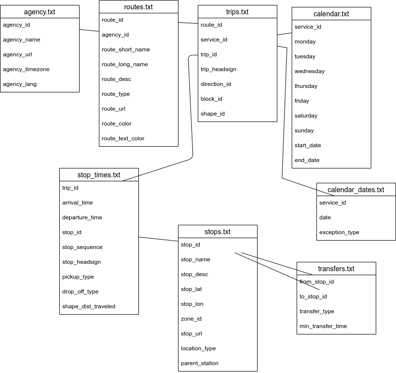
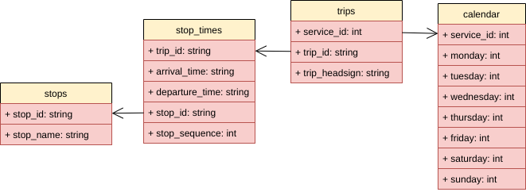
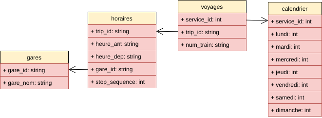

# Cahier des charges

## Fonctions

- [ ] afficher les horaires

- [ ] afficher les tarifs

- [ ] calcul du tarif

  - [ ] en fonction du trajet
  - [ ] en fonction de la catégorie de place
  - [ ] en fonction d'un programme de réduction
  - [ ] en fonction du remplissage

- [ ] réserver des places

- [ ] gestion du nombre de places disponibles

- [ ] catégories de places

- [ ] éditer les billets

- [ ] autocomplétion des noms de ville

## Base de données

### Jeux de données

Les jeux de données utilisés sont ceux de la SNCF, mis à disposition à l'adresse https://ressources.data.sncf.com/explore/.

- Horaires
  - Horaires des TGV : https://ressources.data.sncf.com/explore/dataset/horaires-des-train-voyages-tgvinouiouigo/table/
  - Horaires des lignes TER : https://ressources.data.sncf.com/explore/dataset/sncf-ter-gtfs/table/
  - Horaires des lignes Transilien : https://ressources.data.sncf.com/explore/dataset/sncf-transilien-gtfs/table/
  - Horaires des lignes Intercités : https://ressources.data.sncf.com/explore/dataset/sncf-intercites-gtfs/table/
  - Horaires des Tram-Train TER Pays de la Loire : https://ressources.data.sncf.com/explore/dataset/sncf-tram-train-ter-pdl-gtfs/table/
- Tarifs
  - **à compléter**

### Horaires

#### Description des données SNCF

Les horaires sont décrits par 5 jeux de données (TGV, TER, Transilien, Intercités, Tram-Train TER Pays de la Loire).
De façon identique, chaque jeu de données est constitué de 8 fichiers :

- `agency.txt`
- `calendar_dates.txt`
- `calendar.txt`
- `routes.txt`
- `stop_times.txt`
- `stops.txt`
- `transfers.txt`
- `trips.txt`

Le schéma relationnel est le suivant :
- agency(agency_id, agency_name, agency_url, agency_timezone, agency_lang)
- calendar(Service_id, Monday, Tuesday, Wednesday, Thursday, Friday, Saturday, Sunday, Start_dates, End_dates)
- calendar_dates(Service_id, date, exception_type)
- routes(route_id, agency_id, route_short_name, route_long_name, route_desc, route_type, route_url, route_color, route_text_color)
- stop_times(trip_id, arrival_time, departure_time, stop_id, stop_sequence, stop_headsign, pickup_type, drop_off_type, shape_dist_traveled)
- stops(stop_id, stop_name, stop_desc, stop_lat, stop_lon, zone_id, stop_url, location_type, parent_station)
- trips(route_id, service_id, trip_id, trip_headsign, direction_id, block_id, shape_id)

Le fichier `agency.txt` décrit le fournisseur des données.
Il comporte les champs :

- `agency_id`
- `agency_name` 
- `agency_url`
- `agency_timezone`
- `agency_lang`

Nous excluons ce fichier.

Le fichier `routes.txt` semble décrire les lignes de voie ferrée.
Il est lié à `agency.txt` par le champ `agency_id`.
Il comporte les champs :

- `route_id`
- `agency_id`
- `route_short_name`
- `route_long_name`
- `route_desc`
- `route_type`
- `route_url`
- `route_color`
- `route_text_color`

Nous excluons ce fichier.

Le fichier `trips.txt` semble décrire les lignes commerciales.
Il est lié à `routes.txt` par le champ `route_id`.
Il comporte les champs : 

- `route_id` : l'identifiant de route sur laquelle la ligne commerciale circule.
- `service_id` : l'identifiant du **??service??**
- `trip_id` : l'identifiant du **??trip??**
- `trip_headsign` : le numéro de train tel qu'affiché en gare et sur les billets
- `direction_id`
- `block_id`
- `shape_id`

Nous en conservons les champs :

- `service_id`, lié au fichier calendar
- `trip_headsign` qui renseigne le numéro de train
- `trip_id`, lié au fichier stop_times

Le fichier `stop_times.txt` décrit les arrêts en gare pour un voyage
Il est lié à `trips.txt` par le champ `trip_id`.
Il comporte les champs : 

- `trip_id` : le voyage concerné
- `arrival_time` : l'heure d'arrivée en gare
- `departure_time` : l'heure de départ de la gare
- `stop_id` : l'identifiant de la gare d'arrêt
- `stop_sequence` : l'ordre d'arrêt dans la gare d'arrêt depuis le départ
- `stop_headsign`
- `pickup_type`
- `drop_off_type`
- `shape_dist_traveled`

Nous en conservons les champs :

- `trip_id` pour identifier un voyage unique
- `arrival_time` et
- `departure_time` pour les fonctions de consultation des horaires (et de réservation)
- `stop_id` pour identifier la gare d'arrêt
- `stop_sequence` pour la recherche des gares de destination à partir d'une gare de départ

Le fichier `stops.txt` décrit les lieux d'arrêt ; ils sont multiples pour une même gare.
Il est lié à la table `stop_times.txt` par le champ `stop_id`.
Il comporte les champs :

- `stop_id` : l'identifiant du point d'arrêt en gare. Certains tuples débutent par "StopArea", d'autres par "StopPoint" ; dans ce dernier cas, le tuple possède une valeur pour le champ `parent_station`, qui fait référence au champ `stop_id` de la même gare
- `stop_name` : le nom de la gare d'arrêt
- `stop_desc`
- `stop_lat` : la latitude de la gare d'arrêt
- `stop_lon` : la longitute de la gare d'arrêt
- `zone_id`
- `stop_url` 
- `location_type`
- `parent_station` : la gare dans laquelle se trouve le point d'arrêt lorsque le tuple possède une valeur de `stop_id` commençant par "StopPoint".

Nous en conservons les champs `stop_id` et `stop_name`. La recherche à partir d'un nom de ville pourra ainsi cibler tous les trains au départ de cette ville, quels que soient le nombre de gares qu'elle possède et le nombre de points d'arrêts dans une même gare.

Le fichier `calendar.txt` décrit les jours de service pour un service donné.
Il est lié à `trips.txt` par le champ `service_id`.
Il comporte les champs :

- `service_id` : l'identifiant du **service** concerné
- `monday` : valeur boléenne de circulation le lundi
- `tuesday` : valeur boléenne de circulation le mardi
- `wednesday` : valeur boléenne de circulation le mercredi
- `thursday` : valeur boléenne de circulation le jeudi
- `friday` : valeur boléenne de circulation le vendredi
- `saturday` : valeur boléenne de circulation le samedi
- `sunday` : valeur boléenne de circulation le dimanche
- `start_date` : date de début de validité du service
- `end_date` : date de fin de validité du service

Nous en conservons les champs `service_id`, `monday`, `tuesday`, `wednesday`, `thursday`, `friday`, `saturday` et `sunday`. 
Nous excluons les dates de début et fin de validité du service, qui définissent des périodes très courtes (une dizaine de jours).

Le fichier `calendar_dates.txt` décrit des exceptions au calendrier de circulation défini par `calendar.txt` pour un service donné et une date donnée, en précisant la nature de l'exception.
Il est lié à la table `trips.txt` ou `calendar.txt` par le champ `service_id`
Il comporte les champs : 

- `service_id` : l'identifiant du **service** concerné
- `date` : la date de circulation concernée
- `exception_type` : le type d'exception

Nous exluons ce fichier.

Le fichier `transferts.txt` comporte les champs :

- `from_stop_id`
- `to_stop_id`
- `transfer_type`
- `min_transfer_time`

Il ne contient pas de données dans les jeux de fichiers consultés lors du développement.
Nous excluons ce fichier.

#### Description des données utilisées

Les fichiers de données SNCF sont lus dans leur forme brute par le programme `reservation`. 
Seuls les champs nécessaires aux fonctions du programme sont conservés.

Les champs sont francisés pour être plus explicites.

