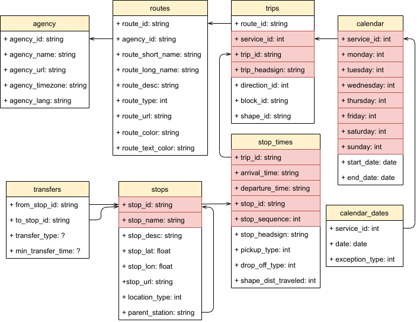

% Cahier des charges

<!-- DANS LE FICHIER DES SUJETS
  logiciel de réservation de place de trains pour une compagnie  nationale (SNCF). Seuls les trajets directs intérieurs sont à envisager. La réservation de places, retire le nombre de place des places disponibles. Prévoir plusieurs catégories de places, donc plusieurs prix. Le logiciel doit permettre d'afficher les horaires, les tarifs et d'effectuer les réservations. 
-->

<!-- MES NOTES LORS DE LA PRESENTATION DES SUJETS
  Pareil (que l'avion), y a des trains différents. Les trains sont différents, n'ont pas le même nb de wagons, le même nb de place (tgv duplex)
  Typologie de trains. 
  1re classe, 2e classe, selon si ça existe sur les trains. Le train fait des escales : ça multiplie les possibilités par rapport à l'avion.
  Peut-être gérer la variation du tarif selon le remplissage. 
-->

<!-- DANS LE MAIL DE JANVIER
  Cahier des charges (CDC) - Analyse : Document WORD, PDF ou OpenOffice de 30 pages + ou - 5 pages (25 pages min - 35 pages max) : 
  vous devez d’abord commencer par l’analyse « métier » c’est a dire expliquer le fonctionnement métier. 
  Par exemple pour une bibliothèque il faut expliquer tout son fonctionnement comme si je ne connaissais rien. 
  Vous présentez votre analyse, ce que vous avez compris, vos choix en termes de modélisation des données et de traitements. 
  Vous expliquez vos difficultés rencontrées. Et seulement à la fin vous faites le lien avec votre programme (succinctement donc c’est pas la majorité des pages!). 
-->

# Présentation générale

## Contexte

La SNCF est une compagnie ferroviaire ayant entre autres activités le transport de voyageurs.
Elle souhaite disposer d'un logiciel (programme ?) de réservation de place : `reservation`.

## Portée

`reservation` est un programme de réservation de place dans les différents modes de transport assurés par la SNCF.

Il permet xx fonctions principales : (ne pas s'arrêter aux interfaces présentées à l'utilisateur ?)

* la consultation d'horaires de voyage entre deux gares données à une date donnée ;
* la consultation des tarifs de ces voyages selon (préciser plus tard ?)
  * la classe du wagon
  * (le profil du voyageur : carte de réduction)
* la réservation de places
* (la gestion des réservations d'un client)

* la gestion des places disponibles à bord d'un train
* le calcul des tarifs de voyage

`reservation` ne permet pas :

* la réservation de voyages incluant des correspondances.

## Définitions

**billet**, **billet de train** : titre de transport valant pour une place et pour un voyage.

**classe** : catégorie de prestation offerte à bord d'un wagon. Certains trains possèdent des wagons de différentes classes : première classe (classe 1) et seconde classe (classe 2). D'autres trains possèdent  des wagons d'une seule et même classe.

**date système**, **date/heure système** et **heure système** : informations de date, date/heure et heure de l'équipement terminal sur lequel le programme est utilisé.  
D'un point de vue métier, il s'agit de la date, date/heure et heure courantes, c'est-à-dire la date, date/heure et heure d'utilisation du programme, sachant que le comportement du programme dépend de cette date, date/heure et heure (les voyages proposés ont une date/heure postérieure à la date courante).  
Dans le programme, ces informations sont obtenues via l'équipement terminal sur lequel le programme est exécuté. Elles s'appellent donc date système, date/heure système et heure système malgré la consonnance très peu « métier ».
* **date** désigne le jour calendaire d'une année donnée (jour de semaine, jour du mois, mois, année). *Exemple : dimanche 14/02/2021*.
* **heure** désigne un horaire (heures et minutes). *Exemple : 23:59*.
* **date/heure** désigne un horaire d'une date. *Exemple : dimanche 14/02/2021 23:59*.

**gare** : station à partir ou au départ de laquelle il est possible de faire un voyage assuré par la SNCF. 
Il peut s'agir d'une gare de chemin de fer ou d'une gare routière. 
Une ville peut posséder plusieurs gares.

**itinéraire** : 

**place** : siège à bord d'un train, réservable par un voyageur pour un voyage.

**rame** : train au sens « matériel roulant». *compléter : dire quels attributs sont propres à la rame (le nb de places, etc.) là où d'autres attributs sont propres au train ou au voyage*

**terminal** : équipement terminal, appareil, sur lequel le programme est utilisé. Dans la version courante du programme, seul l'ordinateur peut être un terminal.

**train** : tout véhicule dont la circulation est assurée par la SNCF et dont l'utilisateur peut réserver une place. 
Les trains sont de différents types, qu'ils circulent sur voie ferrée ou routière (TGV, INOUI, TER, OUIGO, Car).

**trajet** : 

**service** : ligne commerciale définie par une gare de départ, une gare d'arrivée, des gares d'arrêt, des horaires de départ et d'arrivée dans chacune des gares de départ, d'arrivée et d'arrêt, et un calendrier de circulation (circule ou ne circule pas, pour chaque jour de semaine). Le service est le numéro de train utilisé en gare et sur un billet de train pour la communication avec les voyageurs.

**voyage** : déplacement en train entre deux gares à une date donnée.

...

## Vue d'ensemble

Dire comment est structurée la suite du document

# Analyse métier

La SNCF assure la circulation de différents types de trains.

## Train

La SNCF fait circuler différents types de trains, indiqués par le type TGV, INOUI, OUIGO, TER, Intercités, Car.  
Le « type » désigne des réalités mixtes, à la fois commerciales et techniques.

Le train au sens de « matériel roulant » est désigné par « rame ».
Un type de train peut utiliser un ou plusieurs types de rames.
Un train de type Car utilisera probablement une rame standard (un car) avec un nombre de places fixe, tandis qu'un train de type TGV utilise différents types de rames, selon la ligne de chemin de fer (une rame duplex sur Paris-Lyon, une rame simplex sur une autre ligne ou sur un autre service.

Chaque type de rame a une composition propre, mais de façon commune :

* une rame est constituée d'un ou plusieurs wagons
* les wagons d'une rame sont de même classe ou de classes différentes
* un wagon est simplex ou duplex, il possède alors une ou deux salles (salle basse et salle haute)
* une salle est consituée de places
* une place a un placement. Selon le type de wagon dans laquelle elle se trouve, le placement peut être : fenêtre, couloir, isolée.

L'utilisation d'un type de rame en fonction du service est assez complexe à comprendre/trouver.
L'affectation des rames aux services semble avoir une base en partie régionale, liée aux commandes de rames lors de l'ouverture d'une nouvelle ligne.
À titre d'exemple, un TGV peut utiliser une rame TGV Sud-Est, TGV Atlantique, TGV Réseau, TGV Duplex, TGV Réseau Duplex, TGV Duplex Dasye, TGV 2N2, TGV PBA, TGV TMST, TGV POS, TGV 2N2, TGV IRIS 320, TGV M, TGV PBKA, Eurostar e320 (https://fr.wikipedia.org/wiki/Mat%C3%A9riel_moteur_de_la_SNCF#Parc_%C3%A9lectrique).
Dans le cadre de ce prototype, nous utilisons une composition de rame identique pour tous les services d'un même type de train, tout en permettant un paramètrage différent au cas où ces informations deviennent accessibles.

### Composition des rames

#### TGV, INOUI

Une rame de train de type TGV ou INOUI est composée de 8 wagons :

* 1 wagon-bar (n°4)
* 7 wagons de passagers (n°1 à 3 et n°5 à 8)

Parmi les 7 wagons de passagers, 3 sont de classe 1 (n°1 à 3), 4 sont de classe 2 (n°5 à 8).

Une rame de train de type TGV ou INOUI peut être simplex ou duplex.

*Infos wikipédia TGV Duplex (1997 à 2012):  182 en 1re, 328 en 2e (total 510)
TGV 2N2 (duplex à partir de 2011) : 510
simplex : total 133 places de moins*

##### Rame simplex

*Infos wikipédia : => 377places*

Une rame simplex est composée de wagons à 1 niveau.

##### Rame duplex

Une rame duplex est composée de wagons à 2 niveaux, et possède ainsi une salle basse et une salle haute.
Dans une salle, la disposition des sièges n'est pas régulière. Certains sièges sont remplacés par des espaces d'entrepot des bagages.

Une salle de wagon de classe 1 est composée au maximum de 9 rangs de sièges.
Un rang est composé au maxium de 3 sièges, dont 
* un siège situé côté fenêtre
* un siège situé côté couloir
* un siège isolé

Une salle de wagon de classe 2 est composée au maximum de 13 rangs de sièges.
Un rang de composé de 4 sièges, dont
* deux sièges côté fenêtre
* deux sièges côté couloir

#### OUIGO

*Infos wikipédia : 634 places en classe unique*

Un train de type OUIGO est composé de 8 wagons de passagers à 2 niveaux.

Chaque wagon est composé de 

#### TER

#### Intercités

#### Car

### Place

Une place est réservable lorsque le voyage auquel elle correspond est ouvert à la vente.

## Circulation des trains

Les trains circulent selon un calendrier

## Ouverture des ventes

Les ventes de billets sont ouvertes avec une antécédence, par rapport au voyage, différente selon le type de train :

* TGV, INOUI & Intercités : 4 mois, sauf pour les vacances d'été, de Noël et d'hiver
* TGV Bruxelles, Italo, TGV Luxembourg-Paris, TGV Fribourg-Paris : 4 mois
* Trajets RENFE/SNCF, ALLEO France-Allemagne, TGV Lyria (entre Lille et Genève) : 4 mois
* TGV France-Italie : 4 mois
* TER : en fonction des régions, entre 2 et 5 mois
* OUIGO : entre 2 et 9 mois
* THALYS (vers la Belgique, les Pays-Bas, l'Allemagne) : 4 mois
* Eurostar (vers l'Angleterre) : 6 mois pour Paris, Lille et Calais vers London, Ashford, Ebbsfleet, 150 à 280 jours pour Lyon, Marseille et Avignon, vers London, Ashford, Ebbsfleet

L'ouverture des ventes des voyages des vacances de printemps (pour des circulations du 29 mars au 15 mai 2021) se fait le 12 janvier 2021.

Lorsqu'un voyage est ouvert à la vente, ses places doivent être réservables.

Au démarrage du système, il faut 

* charger les données de réservation
* créer des places réservables pour les trains qui s'ouvrent à la vente :
  * regarder la date système
  * parser les services
  * pour chaque service, regarder son type de train
  * calculer la date la plus tardive (date limite) à laquelle ses places sont ouvertes à la réservation
  * si le type est TGV INOUI ou Intercités, si la date tombe dans une période de vacances scolaires, l'ignorer
  * sinon, si elle n'existe pas, créer une rame pour chaque date entre la date système et la date limite, avec les caractéristiques correspondant au type de train
* supprimer les rames des trains qui sont arrivés
  * regarder la date/heure système
  * parser les dates
  * si la date est antérieure à la date système, supprimer ses rames

## Réservation

Le processus de réservation d'une place de train suit généralement les étapes suivantes :

1. Recherche
  * choix de la gare/ville de départ
  * choix de la gare/ville d'arrivée
  * choix de la date
  * choix des options de voyage : classe de wagon, tarif particulier.
2. Consultation des résultats
3. (optionnel) Modification des critères de recherche
4. Choix et réservation d'un voyage parmi les résultats

### Recherche

#### Choix de la gare/ville de départ

Certaines villes possèdent plusieurs gares.
C'est le cas :
* des grandes villes et des villes possédant une gare de chemin de fer historique et une gare TGV située en dehors de la ville sur une ligne à grande vitesse.
* des villes possédant une gare de chemin de fer et une gare routière

Le voyageur peut souhaiter réserver une place pour un voyage au départ ou à l'arrivée d'une ville, indépendamment de la gare de départ ou d'arrivée dans cette ville.
Les résultats affichés doivent inclure les différentes gares d'une même ville.

Si aucun train ne circule au départ de cette ville, le processus de recherche doit s'interrompre.
Il peut éventuellement proposer de saisir une autre ville de départ.

#### Choix de la gare/ville d'arrivée

La problématique gare/ville est identique pour la gare/ville d'arrivée.

Si aucun train ne circule entre la ville de départ et la ville d'arrivée, le processus de recherche doit s'interrompre.
Il peut éventuellement proposer de saisir une autre gare/ville d'arrivée en conservant la gare/ville de départ précédemment choisie. 

#### Choix de la date

La date de voyage ne peut pas être antérieure à la date système.

Si la date saisie est antérieure, le processus de recherche doit s'interrompre.
Il peut éventuellement proposer la saisie d'une autre date en conservant la gare/ville de départ et la gare/ville d'arrivée précédemment choisies.

### Gestion de la date/heure

Concernant la date/heure, le cas de la réservation de voyage et le cas de la consultation d'horaires sont différents.  
Dans le cas d'une réservation de voyage, le programme ne doit pas proposer de résultats de voyages partant à une date/heure antérieure à la date/heure système.
Dans le cas d'une consultation d'horaire, le programme ne doit pas proposer de résultats de voyages arrivant à une date/heure antérieure à la date/heure système.

Un voyageur/agent doit pouvoir consulter les horaires de voyages en indiquant :

* la ville de départ
* la ville d'arrivée

Un voyageur/agent doit pouvoir réserver des places en choisissant :

* la gare de départ
* la gare d'arrivée
* la date du voyage
* le nombre de places

# Spécifications (le lien avec notre programme)

------------------

## Fonctions

* afficher les horaires

* afficher les tarifs

* calcul du tarif

  * en fonction du trajet
  * en fonction de la catégorie de place
  * en fonction d'un programme de réduction
  * en fonction du remplissage

* réserver des places

* gestion du nombre de places disponibles

* catégories de places

* éditer les billets

## Base de données

### Jeux de données

Les ensembles de données utilisés sont ceux mis à disposition par la SNCF à https://ressources.data.sncf.com/explore/

* Horaires
  * Horaires des TGV : https://ressources.data.sncf.com/explore/dataset/horaires-des-train-voyages-tgvinouiouigo/table/
  * Horaires des lignes TER : https://ressources.data.sncf.com/explore/dataset/sncf-ter-gtfs/table/
  * Horaires des lignes Transilien : https://ressources.data.sncf.com/explore/dataset/sncf-transilien-gtfs/table/
  * Horaires des lignes Intercités : https://ressources.data.sncf.com/explore/dataset/sncf-intercites-gtfs/table/
  * Horaires des Tram-Train TER Pays de la Loire : https://ressources.data.sncf.com/explore/dataset/sncf-tram-train-ter-pdl-gtfs/table/
* Tarifs
  * **à compléter**

### Description des données

#### Horaires

Les ensembles de données sont disponibles au format [GTFS](https://fr.wikipedia.org/wiki/General_Transit_Feed_Specification) (*General Transit Feed Specification*), format de ficher standardisé pour les horaires de transports en commun.

##### Description du format GTFS

Parmi les fichiers obligatoires et facultatifs du standard GTFS, chaque ensemble de données Horaires fourni par la SNCF est constitué de 8 fichiers :

* `agency.txt` : Agences de transports en commun ayant un service représenté dans cet ensemble de données.
* `stops.txt` : Arrêts où les voyageurs peuvent monter et descendre. Définit également les stations et leurs entrées.
* `routes.txt` : Itinéraires en transports en commun. Un itinéraire est un ensemble de trajets présentés aux voyageurs  comme relevant du même service.
* `trips.txt` : Trajets pour chaque itinéraire. Un trajet est une série d'au moins deux arrêts desservis à des horaires précis.
* `stop_times.txt` : Heures d'arrivée et de départ d'un train depuis des arrêts spécifiques, pour chaque trajet.
* `calendar.txt` : Dates de service indiquées à l'aide d'un horaire hebdomadaire comportant des dates de départ et d'arrivée.
* `calendar_dates.txt` : Exceptions pour les services définis dans le fichier `calendar.txt`.
* `transfers.txt` : Règles de liaison aux pôles de correspondance entre des itinéraires.

Le schéma logique d'un ensemble de données Horairesest le suivant :

###### Fichier `agency.txt`

Le fichier `agency.txt` décrit les agences de transports en commun ayant un service représenté dans cet ensemble de données. Il s'agit de la SNCF.
Il comporte les champs :

* `agency_id` : indique la marque du réseau de transports en commun (souvent identique au nom de l'agence)
* `agency_name` : nom complet de l'agence de transports en commun.
* `agency_url` : URL de l'agence de transports en commun.
* `agency_timezone` : fuseau horaire de la zone où se trouve l'agence de transports en commun.
* `agency_lang` : langue principale utilisée par cette agence de transports en commun.

###### Fichier `stops.txt`

Le fichier `stops.txt` décrit les arrêts où les voyageurs peuvent monter et descendre, c'est à dire les gares.
Il est lié à la table `stop_times.txt` par le champ `stop_id`.
Il comporte les champs :

* `stop_id` : identifie un arrêt, une station ou une entrée de station.
  Le terme "entrée de station" désigne à la fois les entrées et les sorties de station. Les arrêts, les stations et les entrées de station sont collectivement appelés "emplacements". Le même arrêt peut être desservi par plusieurs itinéraires.
* `stop_name` : nom de l'emplacement.
* `stop_desc` : description de l'emplacement. Ce champ n'est pas toujours renseigné.
* `stop_lat` : latitude de l'emplacement.
* `stop_lon` : longitude de l'emplacement.
* `zone_id` : définit la zone tarifaire d'un arrêt. Ce champ n'est pas toujours renseigné.
* `stop_url` : URL d'une page Web qui décrit l'emplacement. Ce champ n'est pas toujours renseigné.
* `location_type` : type d'emplacement :
  * 0 ou vide : arrêt ou quai (lieu où les usagers montent dans un véhicule de transport en commun ou en descendent). Le terme "quai" est utilisé lorsque cette valeur est définie au sein d'un champ `parent_station`.
  * 1 : station (zone ou structure physique comprenant un ou plusieurs quais)
  * 2 : entrée ou sortie (lieu où les usagers peuvent entrer dans une station depuis la rue ou en sortir). Si une entrée/sortie appartient à plusieurs stations, tous les chemins correspondants sont indiqués, et le fournisseur de données doit désigner une station en tant que station principale (parente).
  * 3 : intersection générique (un emplacement dans une station qui ne correspond à aucune autre valeur `location_type`).
  * 4 : Zone d'embarquement (un emplacement spécifique sur un quai où les usagers peuvent monter à bord d'un véhicule ou en descendre)
* `parent_station` : spécifie la hiérarchie entre les différents emplacements définis dans le fichier `stops.txt`. Contient l'ID de l'emplacement parent, comme suit :
  * Arrêt/quai (`location_type`=0) : le champ `parent_station` contient l'ID d'une station.
  * Station (`location_type`=1) : ce champ doit être vide.
  * Entrée/sortie (`location_type`=2) ou intersection générique (`location_type`=3) : le champ `parent_station` contient l'ID d'une station (`location_type`=1).
  * zone d'embarquement (`location_type`=4) : le champ `parent_station` contient l'ID d'un quai.

###### Fichier `routes.txt`

Le fichier `routes.txt` décrit les itinéraires en transports en commun. Un itinéraire est un ensemble de trajets présentés aux voyageurs comme relevant du même service.
Il est liée à `agency.txt` par le champ `agency_id`.
Il comporte les champs :

* `route_id` : définit un itinéraire.
* `agency_id` : agence pour l'itinéraire spécifié. Fait référence à `agency.agency_id`.
* `route_short_name` : version courte du nom d'un itinéraire. Il s'agit généralement d'un identifiant court, abstrait, comme "32", "100X" ou "vert", que les usagers utilisent pour identifier un itinéraire, sans donner d'indications sur les lieux desservis
* `route_long_name` : le nom complet d'un itinéraire. Ce nom est généralement plus descriptif que la version courte indiquée dans le champ `route_short_name`. Il inclut souvent la destination ou le terminus de l'itinéraire. 
* `route_desc` : description d'un itinéraire. Les informations fournies doivent être utiles et de qualité, elles ne répètent pas le nom de l'itinéraire. Ce champ n'est pas renseigné.
* `route_type` : décrit le moyen de transport utilisé pour un itinéraire. Les options suivantes sont acceptées :
  * `0` : tramway ou métro léger. Tout système de métro léger ou circulant sur la chaussée dans une zone métropolitaine.
  * `1` : métro. Tout système ferroviaire souterrain circulant au sein d'une zone métropolitaine.
  * `2` : train. Utilisé pour les trajets interurbains ou longue distance.
  * `3` : bus. Utilisé pour les lignes de bus courte et longue distance.
  * `4` : ferry. Utilisé pour le service de bateaux courte et longue distance.
  * `5` : tramway à traction par câble. Utilisé pour les systèmes de tramways au niveau de la chaussée dans lesquels le câble passe sous le véhicule, comme c'est le cas à San Francisco.
  * `6` : téléphérique. Service de transport par câble où les cabines, voitures, télécabines ou sièges sont suspendus à l'aide d'un ou de plusieurs câbles.
  * `7` : funiculaire. Tout système ferroviaire conçu pour les pentes raides.
  * `11` : trolleybus. Autobus électrique alimenté par des lignes aériennes de contact.
  * `12` : monorail. Service de chemin de fer roulant sur une voie constituée d'un rail ou d'une poutre unique.
* `route_url` : URL d'une page Web pour un itinéraire spécifique.
* `route_color` : couleur de l'itinéraire correspondant à celle utilisée dans les supports destinés au public.
* `route_text_color` : couleur lisible pour le texte à afficher sur la couleur d'arrière-plan `route_color`.

###### Fichier `trips.txt`

Le fichier `trips.txt` définit les trajets pour chaque itinéraire.
Il est lié à `routes.txt` par le champ `route_id`.
Il comporte les champs : 

* `route_id` : définit un itinéraire. Fait référence à `routes.route_id`.
* `service_id` : définit les dates auxquelles le service est disponible pour un ou plusieurs itinéraires. Fait référence à `calendar.service_id` ou à `calendar_dates.service_id`
* `trip_id` : définit un trajet.
* `trip_headsign` : texte qui apparaît sur la signalétique indiquant aux voyageurs la destination du trajet (le numéro de train tel qu'affiché en gare et sur les billets). Ce champ permet de différencier les modèles de service sur un même itinéraire.
* `direction_id` : indique la direction du trajet. Ce champ n'est pas utilisé pour les itinéraires, mais il permet de distinguer les trajets en fonction de leur direction lors de la publication des horaires. Les options suivantes sont acceptées :
  * `0` : trajet dans un sens (trajet aller, par exemple).
  * `1` : trajet dans le sens opposé (trajet retour, par exemple)
* `block_id` : identifie le bloc auquel appartient le trajet. Un bloc comprend un seul trajet ou de nombreux trajets séquentiels effectués par le même véhicule. Ce champ n'est pas renseigné.
* `shape_id` : définit une forme géospatiale décrivant le parcours du véhicule lors d'un trajet. Ce champ n'est pas renseigné.

###### Fichier `stop_times.txt`

Le fichier `stop_times.txt` définit les heures d'arrivée et de départ d'un train depuis des arrêts spécifiques, pour chaque trajet.
Il est lié à `stops.txt` par le champ `stop_id`.
Il comporte les champs : 

* `trip_id` : définit un trajet. Fait référence à `trips.trip_id`.
* `arrival_time` : heure d'arrivée à un arrêt donné pour un trajet spécifique inclus dans un itinéraire. Si les heures d'arrivée et de départ sont identiques pour un arrêt spécifique, la même valeur est saisie pour les champs `arrival_time` et `departure_time`. Pour les heures après minuit de la journée de service, la valeur saisie est une supérieure à 24:00:00 au format HH:MM:SS dans l'heure locale du jour où commence le trajet.
* `departure_time` : heure de départ depuis un arrêt donné pour un trajet spécifique inclus dans un itinéraire. Si les heures d'arrivée et de départ sont identiques pour un arrêt spécifique, la même valeur est saisie pour les champs `arrival_time` et `departure_time`. Pour les heures après minuit de la journée de service, la valeur saisie est supérieure à 24:00:00 au format HH:MM:SS de l'heure locale le jour où commence le trajet. 
* `stop_id` : identifie l'arrêt desservi. Fait référence à `stops.stop_id`.
* `stop_sequence` : ordre des arrêts desservis lors d'un trajet particulier. Les valeurs augmentent à mesure du trajet, mais ne sont pas nécessairement consécutives.
* `stop_headsign` : texte qui apparaît sur la signalétique indiquant aux voyageurs la destination du trajet.
* `pickup_type` : indique les possibilités de montée à bord. Les options suivantes sont acceptées :
  * `0` ou vide : les usagers peuvent monter à bord aux horaires standards.
  * `1` : les usagers ne peuvent pas monter à bord.
  * `2` : les usagers doivent téléphoner à l'agence pour pouvoir monter à bord.
  * `3` : les usagers doivent contacter le conducteur pour pouvoir monter.
* `drop_off_type` : indique les possibilités de descente du véhicule. Les options suivantes sont acceptées :
  * `0` ou vide : les usagers peuvent monter à bord aux horaires standards.
  * `1` : les usagers ne peuvent pas monter à bord.
  * `2` : les usagers doivent téléphoner à l'agence pour pouvoir monter à bord.
  * `3` : les usagers doivent contacter le conducteur pour pouvoir monter.
* `shape_dist_traveled` : indique la distance réelle parcourue le long du tracé donné entre le premier arrêt et l'arrêt spécifié dans cet enregistrement.

###### Fichier `calendar.txt` 

Le fichier `calendar.txt` définit les dates de service indiquées à l'aide d'un horaire hebdomadaire comportant des dates de départ et d'arrivée.
Il est liée au fichier `trips.txt` par le champ `service_id`.
Il comporte les champs :

* `service_id` : définit de façon unique les dates auxquelles le service est disponible pour un ou plusieurs itinéraires. Fait référence à `trips.service_id`.
* `monday` : indique si le service est proposé tous les lundis de la plage de dates spécifiée par les champs `start_date` et `end_date`. Les options suivantes sont acceptées :
  * `1` : le service est disponible tous les lundis de la plage de dates.
  * `0` : le service n'est pas disponible les lundis de la plage de dates.
* `tuesday` : fonctionne comme le champ `monday`, mais pour les mardis
* `wednesday` : fonctionne comme le champ `monday`, mais pour les mercredis
* `thursday` : fonctionne comme le champ `monday`, mais pour les jeudis
* `friday` : fonctionne comme le champ `monday`, mais pour les vendredis
* `saturday` : fonctionne comme le champ `monday`, mais pour les samedis
* `sunday` : fonctionne comme le champ `monday`, mais pour les dimanches
* `start_date` : date de début de validité du service
* `end_date` : date de fin de validité du service

###### Fichier `calendar_dates.txt`

Le fichier `calendar_dates.txt` définit les exceptions pour les services définis dans le fichier `calendar.txt`.
Il est liée au fichier `calendar.txt` par le champ `service_id`.
Il comporte les champs : 

* `service_id` : définit les dates auxquelles le service est exceptionnellement disponible ou indisponible pour un ou plusieurs itinéraires. Fait référence à `calendar.service_id`.
* `date` : date à laquelle le service proposé est différent du service standard.
* `exception_type` : indique si le service est disponible à la date spécifiée dans le champ date. Les options suivantes sont acceptées :
  * `1` : le service a été ajouté pour la date spécifiée.
  * `2` : le service a été supprimé pour la date spécifiée.

Nous ne nous servont pas de cette table.

###### Fichier `transferts.txt`

Le fichier `transferts.txt` spécifie des règles et des valeurs de remplacement supplémentaires pour les correspondances sélectionnées.
Il comporte les champs :

* `from_stop_id` : identifie l'arrêt ou la station de départ pour une liaison entre deux itinéraires. Si ce champ fait référence à une station, la règle de correspondance s'applique à tous ses arrêts enfants. Fait référence à `stops.stop_id`.
* `to_stop_id` : identifie l'arrêt ou la station de départ pour une liaison entre deux itinéraires. Si ce champ fait référence à une station, la règle de correspondance s'applique à tous ses arrêts enfants. Fait référence à `stops.stop_id`.
* `transfer_type` : Indique le type de correspondance pour la paire (from_stop_id, to_stop_id) spécifiée. Les options suivantes sont acceptées :
  * `0` ou vide : point de correspondance recommandé entre deux itinéraires.
  * `1` : point de correspondance temporisé entre deux itinéraires. Le véhicule qui part doit attendre celui qui arrive et laisser suffisamment de temps pour que les usagers puissent prendre la correspondance.
  * `2` : correspondance nécessitant une durée minimale entre l'heure d'arrivée et l'heure de départ. Spécifiez la durée en question dans le champ `min_transfer_time`.
  * `3` : aucune correspondance ne peut être assurée à cet emplacement.
* `min_transfer_time` : délai (en secondes) devant être accordé pour permettre une correspondance entre deux itinéraires aux arrêts spécifiés.

Le fichier est vide pour les ensembles de données utilisés. Nous ne nous servons pas de ce fichier.

##### Données traitées par le programme

Toutes les données fournies dans un ensemble de données Horaires ne sont pas utiles pour le programme `reservation`.
Parmi les données des ensembles de données, seule une partie est lue par le programme.
Parmi les données lues par le programme, seule une partie est stockée en mémoire.

